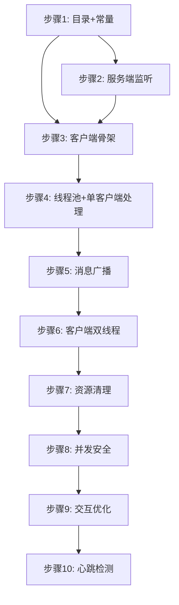

# Socket 聊天室项目 — 开发计划

> 基于 [需求规格说明](./需求规格说明.md) 拆分，按功能优先级从高到低排列。每个步骤均说明**目标、实现方案、涉及文件、验收标准**。

---

## 总览

```
阶段一：骨架搭建（步骤 1~3）       ← 先让服务端和客户端能"通"
阶段二：多客户端支持（步骤 4~6）   ← 核心聊天能力
阶段三：健壮性增强（步骤 7~8）     ← 边界处理
阶段四：体验优化（步骤 9~10）      ← 锦上添花
```

---

## 阶段一：骨架搭建（最高优先级）

### 步骤 1 — 项目目录结构与常量定义

**目标**：搭建包结构，统一管理端口、IP 等常量，避免魔法值。

**实现方案**：

- 包结构：
  ```
  com.chatroom
  ├── server/         服务端
  ├── client/         客户端
  └── common/         公共常量/工具
  ```
- 在 `common/Constants.java` 中集中定义：
  ```java
  public interface Constants {
      int    DEFAULT_PORT     = 8888;
      String DEFAULT_HOST     = "127.0.0.1";
      int    DEFAULT_POOL_SIZE = 10;    // 线程池核心大小
      String CHARSET          = "UTF-8";
  }
  ```

**涉及文件**：
- `src/com/chatroom/common/Constants.java`

**验收标准**：
- 项目编译通过，包结构清晰，后续步骤无硬编码端口/地址。

---

### 步骤 2 — 服务端主线程：端口监听与连接接入

**目标**：服务端启动后能监听端口，接收到客户端连接请求时打印日志。

**实现方案**：

1. 入口类 `ServerMain` 含 `main()` 方法
2. 创建 `ServerSocket(PORT)` 并进入 `while(true)` 循环
3. 每次 `accept()` 返回一个 `Socket`，打印客户端地址
4. 暂时不处理消息（留到步骤 3），先验证连通性

```java
public class ServerMain {
    public static void main(String[] args) throws IOException {
        ServerSocket serverSocket = new ServerSocket(Constants.DEFAULT_PORT);
        System.out.println("服务端启动，监听端口：" + Constants.DEFAULT_PORT);
        while (true) {
            Socket socket = serverSocket.accept();
            System.out.println("新客户端连接：" + socket.getRemoteSocketAddress());
        }
    }
}
```

**涉及文件**：
- `src/com/chatroom/server/ServerMain.java`

**验收标准**：
- 启动服务端，用 `telnet 127.0.0.1 8888` 连接，控制台打印"新客户端连接"日志。

---

### 步骤 3 — 客户端骨架：连接服务端并收发消息（单线程验证）

**目标**：客户端能连接服务端，发送一条消息并接收回显，验证整条链路通畅。

**实现方案**：

1. 入口类 `ClientMain` 含 `main()` 方法
2. 创建 `Socket(host, port)` 连接服务端
3. 获取 `BufferedReader` / `PrintWriter` 进行读写
4. 单线程验证：发送 "hello" → 服务端直接回显 → 客户端打印
5. 此步骤先不拆分收发线程，快速验证链路

```java
// 单线程快速验证版
Socket socket = new Socket(Constants.DEFAULT_HOST, Constants.DEFAULT_PORT);
PrintWriter out = new PrintWriter(socket.getOutputStream(), true);
BufferedReader in = new BufferedReader(new InputStreamReader(socket.getInputStream()));
out.println("hello");
System.out.println("收到：" + in.readLine());
```

> ⚠️ 服务端步骤 2 的代码也同步改为：读一行 → 回写一行，完成回显闭环。

**涉及文件**：
- `src/com/chatroom/client/ClientMain.java`
- 修改 `src/com/chatroom/server/ServerMain.java`（加入回显逻辑）

**验收标准**：
- 客户端发送 "hello"，收到服务端返回的 "hello"，链路验证通过。

---

## 阶段二：多客户端支持（核心功能）

### 步骤 4 — 服务端引入线程池 + 单客户端消息处理

**目标**：服务端使用线程池管理连接，每个客户端在独立线程中完成消息收发。

**实现方案**：

1. 创建 `ExecutorService` 固定大小线程池（`newFixedThreadPool`）
2. `accept()` 拿到 `Socket` 后，提交一个 `Runnable` 任务到线程池
3. 每个任务内部循环 `readLine()` 读取客户端消息并打印日志
4. 读取到 `null`（客户端断开）时退出循环、关闭 socket

```java
ExecutorService pool = Executors.newFixedThreadPool(Constants.DEFAULT_POOL_SIZE);
while (true) {
    Socket socket = serverSocket.accept();
    pool.execute(() -> {
        try (socket; ...) {
            String msg;
            while ((msg = reader.readLine()) != null) {
                System.out.println("收到消息：" + msg);
            }
        } catch (...) { ... }
    });
}
```

**涉及文件**：
- `src/com/chatroom/server/ServerMain.java`
- `src/com/chatroom/server/ClientHandler.java`（新建，封装单个客户端处理逻辑）

**验收标准**：
- 启动服务端，多个 telnet 连接后各自发送消息，服务端分别打印不同来源的消息。

---

### 步骤 5 — 服务端消息广播（核心功能）

**目标**：服务端将任意客户端发来的消息转发给**所有其他在线客户端**。

**实现方案**：

1. 维护全局在线客户端列表：`ConcurrentHashMap<String, PrintWriter>`（key 为客户端 ID/地址，value 为输出流）
2. 客户端连接时：生成唯一 ID → 存入 Map → 广播"[xx 进入了聊天室]"
3. 客户端发消息时：遍历 Map，向**除自己外**的所有客户端 `println(msg)`
4. 客户端断开时：从 Map 移除 → 广播"[xx 离开了聊天室]"
5. **线程安全**：使用 `ConcurrentHashMap` + `synchronized` 保护遍历写入

```java
public class ClientManager {
    private static final ConcurrentHashMap<String, PrintWriter> clients = new ConcurrentHashMap<>();
    
    public static void add(String id, PrintWriter writer) { clients.put(id, writer); }
    public static void remove(String id) { clients.remove(id); }
    
    public static void broadcast(String senderId, String message) {
        for (Map.Entry<String, PrintWriter> entry : clients.entrySet()) {
            if (!entry.getKey().equals(senderId)) {
                entry.getValue().println(message);
            }
        }
    }
}
```

**涉及文件**：
- `src/com/chatroom/server/ClientManager.java`（新建）
- 修改 `src/com/chatroom/server/ClientHandler.java`（接入广播逻辑）

**验收标准**：
- 启动 3 个客户端，A 发送消息，B 和 C 都能收到；A 断线，B 和 C 收到离开通知。

---

### 步骤 6 — 客户端双线程：发送线程 + 接收线程

**目标**：客户端拆分为发送/接收两个独立线程，实现"边输入边收消息"。

**实现方案**：

1. `ClientMain` 连接成功后，分别启动两个线程：
   - **发送线程**：循环读取 `System.in`（`Scanner`），写入 `PrintWriter` 发送到服务端
   - **接收线程**：循环读取 `BufferedReader.readLine()`，打印到控制台
2. 发送线程监听特殊命令（如 `/quit`），触发退出流程
3. 任一线程异常/退出时，通知另一方并关闭 socket

```java
// 接收线程
new Thread(() -> {
    try {
        String msg;
        while ((msg = reader.readLine()) != null) {
            System.out.println(msg);
        }
    } catch (IOException e) { ... }
}).start();

// 发送线程（主线程）
while ((input = scanner.nextLine()) != null) {
    writer.println(input);
    if ("/quit".equals(input)) break;
}
```

**涉及文件**：
- `src/com/chatroom/client/ClientMain.java`
- `src/com/chatroom/client/MessageSender.java`（新建）
- `src/com/chatroom/client/MessageReceiver.java`（新建）

**验收标准**：
- 启动 2 个客户端，A 输入消息的同时能实时看到 B 发来的消息，互不阻塞。

---

## 阶段三：健壮性增强

### 步骤 7 — 资源清理与异常处理

**目标**：客户端异常断线（直接关窗口、网络中断等）时，服务端不崩溃，资源不泄漏。

**实现方案**：

1. 所有 IO 资源使用 **try-with-resources** 自动关闭
2. 服务端 `ClientHandler` 的 `finally` 块中：
   - 从 `ClientManager` 移除该客户端
   - 广播离开通知
   - 关闭 Socket
3. 捕获 `SocketException` / `EOFException` 视为正常断线（打印 info 而非 error）
4. 服务端 `ServerSocket` 注册 shutdown hook（`Runtime.getRuntime().addShutdownHook`），JVM 退出时关闭线程池和 ServerSocket

```java
// ClientHandler 核心结构
try (socket; writer; reader) {
    // 消息循环
} catch (SocketException e) {
    System.out.println("客户端异常断开：" + clientId);
} finally {
    ClientManager.remove(clientId);
    ClientManager.broadcast(clientId, "[系统]" + clientId + " 离开了聊天室");
}
```

**涉及文件**：
- 修改 `src/com/chatroom/server/ClientHandler.java`
- 修改 `src/com/chatroom/server/ServerMain.java`
- 修改 `src/com/chatroom/client/ClientMain.java`

**验收标准**：
- 客户端直接关闭窗口，服务端不报异常堆栈，仅打印 info 日志，其余客户端收到离开通知。
- 连续 10 个客户端快速连入断线，服务端内存和线程数稳定。

---

### 步骤 8 — 并发安全加固

**目标**：高并发场景下消息不丢失、不重复、不乱序。

**实现方案**：

1. `ClientManager.broadcast()` 中对 `clients` 的遍历使用 `synchronized` 块包裹，防止遍历期间 Map 被修改导致 `ConcurrentModificationException`
2. 或者在广播前快照复制一份在线列表：

```java
public static void broadcast(String senderId, String message) {
    // 快照避免并发修改
    Map<String, PrintWriter> snapshot = new HashMap<>(clients);
    for (Map.Entry<String, PrintWriter> entry : snapshot.entrySet()) {
        if (!entry.getKey().equals(senderId)) {
            try {
                entry.getValue().println(message);
                entry.getValue().flush();  // 确保立即发送
            } catch (Exception e) {
                // 发送失败（客户端已断开但尚未清理），跳过
            }
        }
    }
}
```

3. 每个 `PrintWriter.println()` 后立即 `flush()`，避免缓冲区延迟

**涉及文件**：
- 修改 `src/com/chatroom/server/ClientManager.java`

**验收标准**：
- 编写简单并发测试：10 个线程同时调用 `broadcast()` + `add()` + `remove()`，无异常。

---

## 阶段四：体验优化

### 步骤 9 — 客户端交互优化

**目标**：提升命令行使用体验。

**实现方案**：

1. **启动提示**：连接成功后打印欢迎信息和使用说明
   ```
   ===== 欢迎来到聊天室！=====
   输入消息直接发送，输入 /quit 退出，输入 /who 查看在线用户
   =============================
   ```
2. **在线用户列表**：客户端输入 `/who`，服务端返回当前在线用户列表
3. **消息格式化**：服务端转发时加上发送者前缀 `[小明]：你好`
4. **昵称设置**：客户端启动时支持命令行参数传入昵称，如 `java ClientMain 小明`

**涉及文件**：
- `src/com/chatroom/client/ClientMain.java`
- `src/com/chatroom/server/ClientHandler.java`
- `src/com/chatroom/server/ClientManager.java`

**验收标准**：
- 客户端启动显示欢迎语；输入 `/who` 显示在线用户；消息带昵称前缀。

---

### 步骤 10 — 心跳检测与超时断开

**目标**：检测"假死"连接（网络中断但 TCP 未感知），及时清理。

**实现方案**：

1. 服务端为每个客户端连接设置 `socket.setSoTimeout(30_000)`（30 秒读超时）
2. 超时后 `readLine()` 抛出 `SocketTimeoutException`，视为假死断开
3. 客户端增加定时心跳线程，每 15 秒发送一条特殊心跳消息 `PING`（或空行）
4. 服务端过滤心跳消息，不转发给其他客户端

```java
// 服务端设置读超时
socket.setSoTimeout(30_000);

// 客户端心跳线程
new Thread(() -> {
    while (!Thread.currentThread().isInterrupted()) {
        Thread.sleep(15_000);
        writer.println("PING");
    }
}).start();
```

**涉及文件**：
- 修改 `src/com/chatroom/server/ClientHandler.java`
- 修改 `src/com/chatroom/client/ClientMain.java`

**验收标准**：
- 客户端网络断开（拔网线）后 30 秒内，服务端自动清理该连接并广播离开通知。

---

## 附录：完整文件清单

| 序号 | 文件路径 | 职责 |
|:---:|---|------|
| 1 | `src/com/chatroom/common/Constants.java` | 全局常量 |
| 2 | `src/com/chatroom/server/ServerMain.java` | 服务端入口，监听与线程池 |
| 3 | `src/com/chatroom/server/ClientHandler.java` | 单个客户端消息处理 |
| 4 | `src/com/chatroom/server/ClientManager.java` | 在线客户端管理 + 广播 |
| 5 | `src/com/chatroom/client/ClientMain.java` | 客户端入口，协调收发线程 |
| 6 | `src/com/chatroom/client/MessageSender.java` | 客户端发送线程 |
| 7 | `src/com/chatroom/client/MessageReceiver.java` | 客户端接收线程 |

---

## 附录：开发顺序与依赖关系



> 步骤 1~6 是核心功能，必须按顺序完成；步骤 7~10 可适当并行开发。
